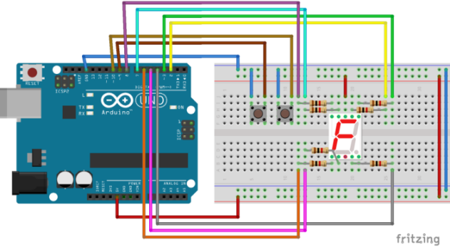

## counter-7seg
Toy program to test Rust support for Arduino Uno. Using two buttons it increase, and decrease value presented on seven-segment display. It use
[avr-hal](https://github.com/Rahix/avr-hal) to build binary for AVR microcontroller. It also contains sketch in Arduino C - [sketch_main.ino](./sketch_main/sketch_main.ino).

